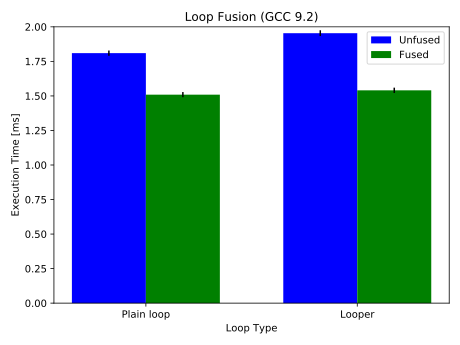
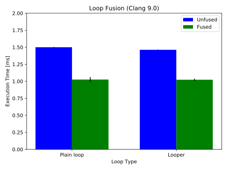
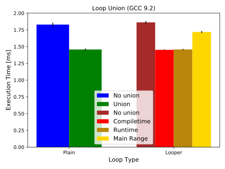
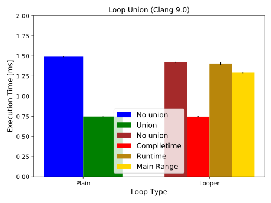

# Benchmarks

The project contains two benchmarks in the `benchmarks/` directory to give an
idea of how each implementation performs. As the implementations of
`loop_fusion` rely heavily on compiler optimization, it only makes sense to run
these benchmarks with optimizations turned on (i.e., `Release` or
`RelWithDebInfo` in cmake, or `-O3` in GCC and Clang).

The first benchmark is called [Loop Fusion benchmark](../benchmarks/benchmark_loop_fusion.cpp) and compares the performance of three
different unfused and fused loops over the same range, using both plain
(handwritten) loops and the looper class. As all three implementations (cf.
[Design Decisions](./DesignDecisions.md)) use a very similar version of the
looper class, only one of them is bechmarked
here(`loop_fusion::compiletime::looper`).

```cpp
// Loop fusion benchmark (basic concept)
for (size_t i = 0; i < 1000000; ++i) {
    c[i] = a[i] + b[i];
}
for (size_t i = 0; i < 1000000; ++i) {
    d[i] = c[i] * a[i];
}
for (size_t i = 0; i < 1000000; ++i) {
    c[i] = d[i] - a[i];
}
```

The second benchmark, the [Loop Union benchmark](../benchmarks/benchmark_loop_union.cpp), compares the performance for different
loopers of different ranges, once with union (i.e., merged ranges and loopers)
and once without. For this, all three implementations as well as the plain loop
version are included. Note that the plain "handwritten" loop version used in
this benchmark would not be possible in a real scenario unless the programmer
knows all ranges while writing the code and can therefore determine how the
loops are to be merged and subdivided. Thus, it might not be realistic to see
such code in a real world scenario and if it performs better than any of the
three `loop_fusion` implementations, that should be taken with a grain of salt.

```cpp
// Loop union benchmark (basic concept)
for (size_t i = 0; i < 1000000; ++i) {
    d[i] = b[i];
    c[i] = a[i] + b[i];
}
for (size_t i = 5000; i < 400000; ++i) {
    d[i] = c[i] * a[i];
}
for (size_t i = 50000; i < 600000; ++i) {
    c[i] = d[i] - a[i];
}
for (size_t i = 300000; i < 900000; ++i) {
    d[i] += a[i];
}
```

The benchmarks have been run on the `mp-skl2s24c` compute node
of the [ASC network](https://mp-force.ziti.uni-heidelberg.de/asc/doc/wiki/wikis/Technical-notes/ASC-server-hardware) with GCC 9.2 and with Clang 9.0.
The resulting plots as well as the plain text output by the benchmark jobs can be seen below.

GCC 9.2 | Clang 9.0
:-:|:-:
 | 
 | 


## Differences Between Results

As can be seen in the plots, Clang performs better than GCC in most cases.
This is due to Clang being able to efficiently apply vectorization and partial loop unrolling in the examples chosen for the benchmarks.
Furthermore, both GCC and Clang generate the same assembly code for both a) fused plain loop and looper and b) plain loop union and compiletime union.
In particular, the compiletime union is able to benefit from the same vectorization and partial loop unrolling optimizations that Clang applies to the plain loop union.
While in comparison the runtime union appears to be performing far worse than the plain loop union or compiletime union in Clang, a closer look reveals that the performance of the runtime union is basically equal between Clang and GCC.
Unfortunately though, Clang is not able to apply the same vectorization and partial loop unrolling optimizations to the runtime union.
While the main range union is able to benefit from these optimizations in Clang, this makes it only marginally faster than the runtime unions as it can't make as much use of CPU caching with its single common range.

In an earlier version of the benchmark used during the oral presentation, the compiletime union performed worse than the plain loop union in Clang although both would result in the same assembly code in a naive example.
This was caused because the operation lambdas used by the compiletime union benchmark were not defined in the benchmark function's scope but outside in the test case's scope.
Effectively, Clang was unable to apply the same optimizations because of this.
Moving the lambdas to the benchmark scope solved this issue and let Clang apply vectorization and partial loop unrolling again.

## Benchmark Job Output

### GCC 9.2

```
Job: loop_fusion_benchmarks
Host: mp-skl2s24c.ziti.uni-heidelberg.de
Date: Tue Feb 4 22:39:12 CET 2020
Working directory: /home/nfs/nkorz/benchmarks/gcc

~~~~~~~~~~~~~~~~~~~~~~~~~~~~~~~~~~~~~~~~~~~~~~~~~~~~~~~~~~~~~~~~~~~~~~~~~~~~~~~
loop_fusion_benchmarks is a Catch v2.11.1 host application.
Run with -? for options

-------------------------------------------------------------------------------
Loop fusion benchmark
-------------------------------------------------------------------------------
/home/nfs/nkorz/fbench/benchmarks/benchmark_loop_fusion.cpp:12
...............................................................................

benchmark name                                  samples       iterations    estimated
                                                mean          low mean      high mean
                                                std dev       low std dev   high std dev
-------------------------------------------------------------------------------
Plain loop (unfused)                                    10000             1     18.2553 s
                                                   1.80955 ms    1.80918 ms    1.80992 ms
                                                    19.045 us     18.535 us     19.616 us

Plain loop (fused)                                      10000             1     14.8603 s
                                                   1.50909 ms    1.50872 ms    1.50945 ms
                                                    18.605 us     18.358 us     18.882 us

Looper (unfused)                                        10000             1     19.5789 s
                                                    1.9541 ms    1.95369 ms    1.95452 ms
                                                    21.154 us     20.751 us     21.604 us

Looper (fused)                                          10000             1     15.6335 s
                                                   1.54032 ms    1.53994 ms     1.5407 ms
                                                    19.385 us     19.121 us      19.67 us


-------------------------------------------------------------------------------
Loop union benchmark
-------------------------------------------------------------------------------
/home/nfs/nkorz/fbench/benchmarks/benchmark_loop_union.cpp:12
...............................................................................

benchmark name                                  samples       iterations    estimated
                                                mean          low mean      high mean
                                                std dev       low std dev   high std dev
-------------------------------------------------------------------------------
Plain loop (no union)                                   10000             1     18.8533 s
                                                   1.82925 ms    1.82869 ms     1.8298 ms
                                                    28.459 us      27.88 us      29.08 us

Plain loop (union)                                      10000             1     14.6115 s
                                                   1.45749 ms    1.45718 ms     1.4578 ms
                                                    15.856 us     15.504 us     16.271 us

Looper (no union)                                       10000             1     18.5696 s
                                                   1.86262 ms    1.86223 ms      1.863 ms
                                                    19.637 us     19.346 us     19.955 us

Looper (compiletime union)                              10000             1     14.5445 s
                                                   1.45204 ms    1.45189 ms    1.45219 ms
                                                     7.472 us       7.12 us      7.911 us

Looper (runtime union)                                  10000             1     14.6089 s
                                                   1.45778 ms    1.45762 ms    1.45795 ms
                                                       8.6 us      8.196 us      9.081 us

Looper (main_range union)                               10000             1     17.1363 s
                                                   1.71826 ms    1.71795 ms    1.71856 ms
                                                     15.53 us      15.11 us     16.009 us


===============================================================================
All tests passed (16 assertions in 2 test cases)
```

### Clang 9.0

```
Job: loop_fusion_benchmarks
Host: mp-skl2s24c.ziti.uni-heidelberg.de
Date: Tue Feb 4 22:50:12 CET 2020
Working directory: /home/nfs/nkorz/benchmarks/clang

~~~~~~~~~~~~~~~~~~~~~~~~~~~~~~~~~~~~~~~~~~~~~~~~~~~~~~~~~~~~~~~~~~~~~~~~~~~~~~~
loop_fusion_benchmarks is a Catch v2.11.1 host application.
Run with -? for options

-------------------------------------------------------------------------------
Loop fusion benchmark
-------------------------------------------------------------------------------
/home/nfs/nkorz/fbench/benchmarks/benchmark_loop_fusion.cpp:12
...............................................................................

benchmark name                                  samples       iterations    estimated
                                                mean          low mean      high mean
                                                std dev       low std dev   high std dev
-------------------------------------------------------------------------------
Plain loop (unfused)                                    10000             1     14.9972 s
                                                   1.50009 ms    1.50001 ms    1.50018 ms
                                                     4.256 us      4.085 us      4.481 us

Plain loop (fused)                                      10000             1     10.3502 s
                                                   1.02518 ms    1.02472 ms    1.02658 ms
                                                    37.228 us     16.236 us     83.536 us

Looper (unfused)                                        10000             1      14.617 s
                                                   1.46267 ms     1.4626 ms    1.46275 ms
                                                     3.931 us      3.715 us      4.185 us

Looper (fused)                                          10000             1     10.2414 s
                                                   1.02317 ms    1.02285 ms    1.02348 ms
                                                    15.978 us     15.681 us     16.284 us


-------------------------------------------------------------------------------
Loop union benchmark
-------------------------------------------------------------------------------
/home/nfs/nkorz/fbench/benchmarks/benchmark_loop_union.cpp:12
...............................................................................

benchmark name                                  samples       iterations    estimated
                                                mean          low mean      high mean
                                                std dev       low std dev   high std dev
-------------------------------------------------------------------------------
Plain loop (no union)                                   10000             1     14.8943 s
                                                    1.4911 ms    1.49098 ms    1.49123 ms
                                                     6.544 us      6.393 us      6.726 us

Plain loop (union)                                      10000             1     7.50976 s
                                                   750.025 us    749.927 us    750.124 us
                                                     4.996 us      4.882 us      5.146 us

Looper (no union)                                       10000             1     14.2259 s
                                                   1.42224 ms    1.42211 ms    1.42239 ms
                                                      7.17 us      7.029 us      7.337 us

Looper (compiletime union)                              10000             1     7.49454 s
                                                   748.351 us    748.259 us    748.443 us
                                                     4.699 us      4.622 us      4.795 us

Looper (runtime union)                                  10000             1     14.0634 s
                                                   1.40692 ms    1.40661 ms    1.40724 ms
                                                    15.924 us     15.007 us     16.903 us

Looper (main_range union)                               10000             1     12.9186 s
                                                    1.2932 ms    1.29306 ms    1.29335 ms
                                                     7.506 us       7.17 us      7.893 us


===============================================================================
All tests passed (16 assertions in 2 test cases)
```
