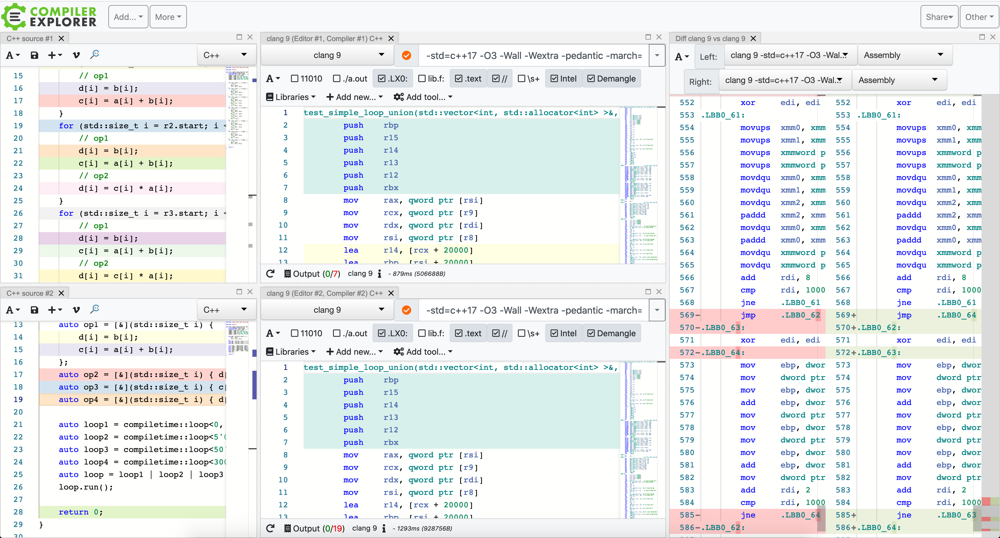

# Design Decisions

 1. API
 1. Execution Order
 1. C++ Standard
 1. Different loop implementations

## API
We want the API to be as intuitive as possible. To achieve this, we use the
following conventions:

 1. Pipe Operator (`|`) for concatenation / merging  
    We can add one function to a looper by simply "appending" it using the
    pipe, e.g. `loop_to(size)` is a looper without functions.
    `loop_to(size) | fct1 | fct2` adds two functions to the looper which will
    be executed after another in each iteration. The same principle can be
    applied to looper_unions: `loop_to(20, fct1) | loop_to(10, fct2)`.
 1. Creating a looper does not execute it  
    The user shall have the control over when a looper and looper_union is
    executed. Both looper and looper_union have a `run()` method which
    executes all loops and functions. The user shall not have to think about
    whether he has a looper or looper_union. The behavior shall be the same.
 1. Convenience functions  
    While it is possible to construct a looper by oneself and a looper_union
    as well, convenience functions shall be provided so that users do not have
    to specify template arguments and can rely on template type deduction.  
    Following functions shall be provided (similar for compiletime loops):
     - `loop(range, functions...)`              => with user specified range
     - `loop_to(end, functions...)`             => `[0, end)`
     - `loop_from_to(start, end, functions...)` => `[start, end)`

## Execution Order
The looper and looper_union classes may *not* change the execution order of
functions if they are to be run over the same range.

For example, given this code:

```cpp
(loop_from_to(10, 20, fct1) | loop_from_to(0, 10, fct2, fct3)).run()
```

The function `fc2` is obviously executed before `fct1`. However, `fct2` must
always be executed before `fct3` as they have the same range.

## C++ Standard
The C++ standard shall be C++17. This version introduces better template type
deduction as further types like `std::variant` that are necessary for this
library. C++20 may be required in future versions.

## Different loop implementations
To show how one can merge loops, we differentiate between three
implementations:

 - Compile-Time-Only loop merging
 - Main range loop merging
 - Runtime loop merging

All three have in common that the range is exclusive for the "end" argument.
This means that `range{0,10}` is the range `[0,10)`. Furthermore, they all use a
similar `looper` class at their core that takes a range and an arbitrary amount
of invocables that are executed on the specified range in the specified order.
Preferably, these invokables are lambdas as they can easily be inlined by the
compiler. To avoid any runtime overhead, the invocables are stored as tuples and
inlined with fold expressions. The implementations mainly differ in how they
merge and execute loops of different ranges, for example intersecting or
disjunct ranges.

### Compile-Time-Only-Loops
We provide a compile-time-only looper_union. This allows better merging and
optimization of loops with the disadvantage of not having runtime bounds
(hence the name).

Please refer to [Merging Loops](./MergingLoops.md) for more details on how we
do compile-time-only merging.

A benefit of compile-time merging is that the generated assembly will look the
same as if we had merged the loops by hand (except for maybe assembler label names):



### Main range loop merging
The main_range loop merger does not do a full merging but instead only looks for
the largest intersection of *all* given ranges.

For example, assume the following ranges:

```
[--------------------------] Looper 1
   [-----------------]       Looper 2
         [--------------]    Looper 3
^  ^     ^           ^  ^  ^
1  2     3           4  5  6
```

These 3 ranges (looper instances) have only one common intersection: `[3, 4)`.
No further merging is performed. The example above will result in the
following execution order:

```
Looper 1:         [1, 3)
Looper 2:         [2, 3)
Looper 1 + 2 + 3: [3, 4)
Looper 1:         [4, 6)
Looper 3:         [4, 5)
```

**Why don't you do the same merging as for the compile-time-only merger?**  
The reason is simple: Each looper is a different type (due to the lambdas).
If we want to create new looper objects with different ranges, we have to know
the ranges during compile time or otherwise we won't be able to generate
looper instances with more/fewer lambdas. For example:

```cpp
auto l1 = looper<F1, F2>(range{0, 10}, f1, f2);
auto l2 = looper<F3, F4>(range{5, 15}, f4, f4);
```

We would have to create a type `looper<F1, F2, F3, F4>` because the range
`[5, 10)` is intersected by `l1` and `l2`. However, we know this fact only
during compile time.

A workaround that we came up with can be seen in the `runtime` implementation.
There we make use of `std::variant` to wrap the loopers. This results in a
type explosion, though.

### Runtime loop merging

To be able to support arbitrary ranges at runtime, for example when using
dynamically sized vectors whose size is not known at compile time, the runtime
union takes a more flexible albeit possibly slower approach to merging. To
determine which functions are to be executed for which ranges, the looper
union's merge operator (`operator|`) compares the ranges of all already stored
loopers to the range of the newly added looper. Loopers of equal ranges are
merged into one looper, using the same range and a concattenated tuple of both
looper's functions, preserving their order of execution. In the case of
intersecting ranges, the operator adds two or three new loopers, depending on
whether one of the ranges is a subset of the other. The first possible looper
then contains all functions to be executed before the intersection, the second
one all functions for the intersection itself, and the last one the functions to
be executed after the intersection. Disjunct ranges are just added as-is to the
list. The merge operation always keeps the list of loopers sorted by range.

Loopers can differ in both their specified range as well as their tuple of 
functions. While the former is simply stored as an instance variable, the latter
defines a looper's class signature through the template.
Therefore, keeping a list of loopers that contain different functions either
involves using an abstract base class and virtual functions or making use of
`std::variant` and `std::visit`.
The implementation of the runtime looper union chooses the latter approach,
making the variants stored by a union part of its class signature.
To achieve this, `loop_fusion::runtime::types` defines a few helper types:
First, there is the `looper_append_t` helper whose template takes a looper
class type and a variable number of function types to be added to the looper's
class signature.
This helper is then used in a similar helper `variant_append_t` which takes a
`std::variant` type as well as function types.
The variant append helper returns a new `std::variant` type that contains all
loopers of the input `std::variant`, but also adds all input function types to
all existing looper types as well as a single looper type only containing the
input function types.

This approach soon raises the problem that adding loopers that share an equal
class signature, i.e. they use the same functions although possibly on different
ranges, will result in a `std::variant` that contains duplicate types.
As can be tested in a very short example, assigning a value to such a variant
will result in a compiler error as the compiler cannot determine which of the
variant's type is meant:

```cpp
#include <variant>

int main() {
   std::variant<int, int> i_will_fail;
   i_will_fail = 0;
}
```

To solve this issue, another helper type is introduced. `unique_variant` takes a
variadic template of types and returns a `std::variant` type that only contains
each type once, even if (or rather, especially if) the variadic template
contains certain types multiple times. This helper makes use of the recursively
defined type `unique` that starts with an empty variant type and adds each input
type only if it is not already contained in the variant type. Once the variadic
list of types is exhausted, `unique` resolves to the final variant type by
making use of partial template specialization and `std::type_identity`. As
`std::type_identity` has only been introduced with C++ 20 and this project
currently makes no use of any other C++ 20 features, it has been decided to
include a small handwritten definition of `type_identity` in the
`loop_fusion::runtime::types` namespace.

The runtime implementation has two obvious downsides:
As the number of final ranges cannot be known at compiletime, looper union
stores its loopers in a `std::vector` whose size is only known after the merge
operation `operator|` has been executed.
For execution, the looper union has to iterate over this vector, introducing
additional runtime overhead that may not be noticable if the total range
(i.e., all of the union's ranges combined) is far larger than the number of 
ranges. However, if the final union consists of many small ranges, the resulting
performance will almost certainly be worse than just executing the plain
unmerged loops separately.
Additionally, if many loopers are merged into one union, its `std::variant`
will become quite complex. `2^N - 1` looper types will be stored in the variant
because all combinations will stored. If there are two loopers, there are 3
possible outcomes: Both loopers in one range, just the first one or just the
second one. For 3 loopers, there are `2^3-1=7` combinations and so on.
As `std::visit`, which is used for executing a union's loopers, has no
complexity guarantees for a number of variants larger than one, the performance
hit this introduces may vary.
